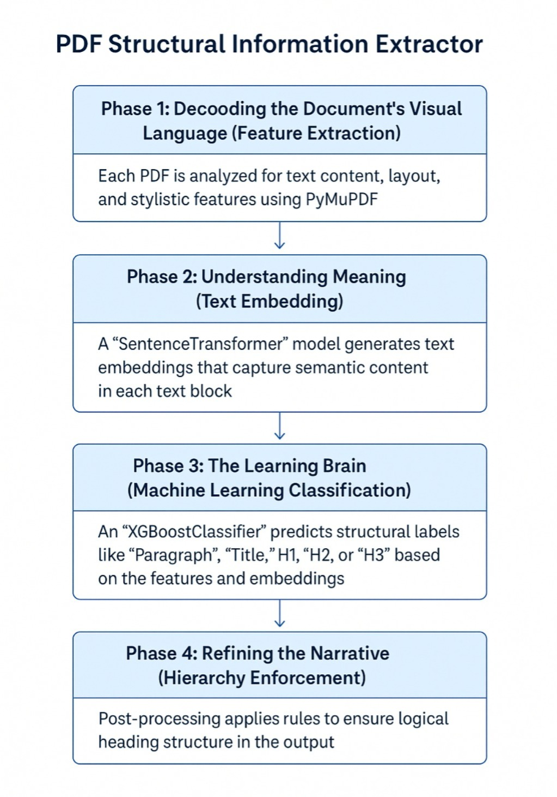

# PDF Structural Information Extractor

## Project Overview

This project delivers a machine learning-powered solution designed to automatically extract and classify structural elements (like titles and headings) from PDF documents. It transforms unstructured PDF content into machine-readable JSON formats, enabling easier data utilization and analysis.

## Our Approach: An Intelligent Document Processing Pipeline



Our solution processes PDFs through a precise, multi-stage pipeline for accurate structural understanding:

1.  ### Phase 1: Decoding Visual & Layout Cues (Feature Extraction)
    The process begins by parsing PDF documents with `PyMuPDF`. For each text block, we extract various layout and stylistic features, including: word count, normalized font size, bold/all-caps indicators, block dimensions, positioning, centering, and numeric/Roman numeral prefixes.

2.  ### Phase 2: Understanding Semantic Meaning (Text Embedding)
    To capture the contextual meaning of text, we utilize a pre-trained multilingual `SentenceTransformer` model (`'all-MiniLM-L6-v2'`). This model converts text blocks into dense numerical vectors (embeddings), allowing our system to semantically distinguish content roles.

3.  ### Phase 3: The Learning Engine (Machine Learning Classification)
    An `XGBoostClassifier` serves as our core classification model. Trained on a combined feature set (layout features + text embeddings), it learns to map these inputs to structural labels like 'Paragraph', 'Title', 'H1', 'H2', or 'H3'. Data balancing, achieved by downsampling the overrepresented 'paragraph' class, ensures robust learning across all categories.

4.  ### Phase 4: Refining Structure (Hierarchy Enforcement)
    After initial predictions from the `XGBoost` model, a crucial post-processing step applies common-sense rules to ensure logical document hierarchy:
    * Long text blocks predicted as headings are demoted to paragraphs.
    * Only one primary document title is retained; subsequent "titles" are reclassified as H1s.
    * Strict hierarchical order is enforced (e.g., an H3 cannot directly follow an H1 without an H2).

5.  ### Phase 5: The Structured Output (JSON Generation)
    The final, corrected structural predictions are then transformed into a clean, machine-readable JSON file (`_outline.json`) for each processed PDF. This JSON includes the document's main `title` and a structured `outline` array detailing all identified headings, their hierarchical `level`, and their `page` number.

## Key Technologies & Models

**Programming Language:** Python

**Core Libraries:**
* `pymupdf` (Fitz): PDF parsing and feature extraction.
* `pandas`: Data manipulation and feature preparation.
* `xgboost`: Classification model.
* `sentence_transformers`: Text embedding generation.
* `scikit-learn`: Data splitting and evaluation.
* Standard Python modules: `re`, `json`, `uuid`, `os`.

**Machine Learning Models:**
* **Text Embedding Model:** `SentenceTransformer('all-MiniLM-L6-v2')`
* **Classification Model:** `xgboost.XGBClassifier`

## Performance Metrics

The `XGBoostClassifier`'s performance was evaluated on a test set, yielding the following metrics from the classification report:

| Label           | Precision | Recall | F1-Score |
| :-------------- | :-------- | :----- | :------- |
| **0 (Paragraph)** | 0.823     | 0.895  | 0.858    |
| **1 (Title)** | 1.000     | 0.942  | 0.970    |
| **2 (H1)** | 0.889     | 0.589  | 0.708    |
| **3 (H2)** | 0.823     | 0.598  | 0.693    |
| **4 (H3)** | 0.769     | 0.790  | 0.779    |
| **Macro Avg** | 0.861     | 0.763  | 0.802    |
| **Weighted Avg**| 0.819     | 0.817  | 0.813    |

The model demonstrates strong performance across structural labels, with particularly high precision for titles and robust F1-scores.

## Execution Instructions (Dockerized Environment)

For consistent and portable deployment, a `Dockerfile` is included in this submission to containerize the solution. The following Docker commands, provided by the organizers, detail how to build and run the solution within this environment.

### 1. Building the Docker Image

Navigate to the project's root directory (containing the `Dockerfile`) and execute the organizer-specified build command:

```bash
docker build --platform linux/amd64 -t mysolutionname:somerandomidentifier .
